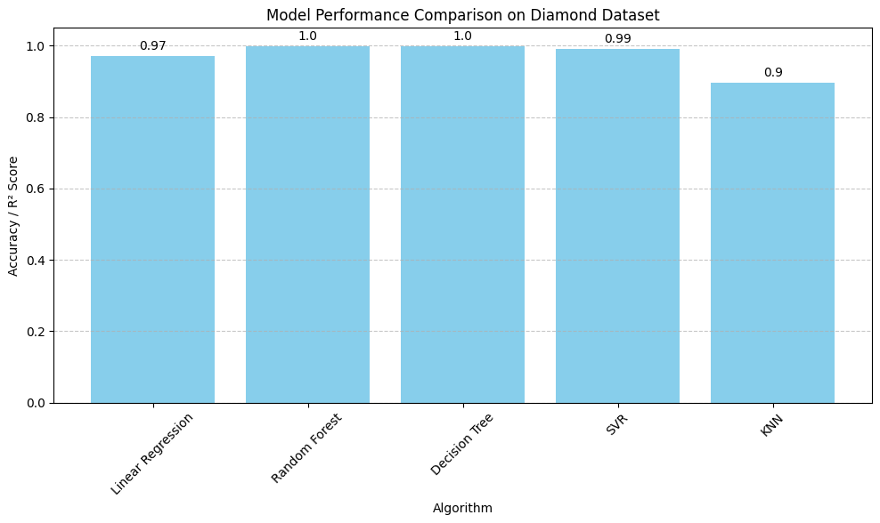

# 💎 Diamond Carat Prediction 💎

A machine learning application that predicts the carat weight of diamonds based on their physical characteristics using a Random Forest Regressor model.

## 📖 Overview

This project uses machine learning to predict diamond carat weight based on various physical properties such as cut, color, clarity, depth, and dimensions. The application is built with [Streamlit](https://streamlit.io/) for an interactive web interface, making it easy for users to input diamond characteristics and get instant predictions.

## ✨ Features

- **Interactive Web Interface**: Built with Streamlit for easy user interaction
- **Real-time Predictions**: Input diamond features and get immediate carat predictions
- **Machine Learning Model**: Trained Random Forest Regressor with high accuracy
- **Model Performance Metrics**: Displays R² score on test data
- **Data Exploration**: View samples from the diamond dataset
- **Feature Input**:
  - Categorical features: Cut, Color, and Clarity
  - Numerical features: Depth, Table, Price, Length (X), Width (Y), Depth (Z)

## 🚀 Installation

### Prerequisites

- Python 3.7 or higher
- pip (Python package manager)

### Setup Instructions

1. **Clone the repository**
   ```bash
   git clone https://github.com/Mr-J12/DiamondCaratPrediction.git
   cd DiamondCaratPrediction
   ```

2. **Create a virtual environment (optional but recommended)**
   ```bash
   python -m venv venv
   # On Windows
   venv\Scripts\activate
   # On macOS/Linux
   source venv/bin/activate
   ```

3. **Install dependencies**
   ```bash
   pip install -r requirements.txt
   ```

4. **Ensure the dataset is present**
   - Make sure `diamonds.csv` is in the project directory

## 💻 Usage

To run the application:

```bash
streamlit run model.py
```

This will start a local web server. Open your browser and navigate to `http://localhost:8501` to access the application.

### How to Use the Application

1. **Input Diamond Features**: Use the sidebar to select or input the diamond's characteristics:
   - **Cut**: Select from available cut grades (Fair, Good, Very Good, Premium, Ideal)
   - **Color**: Select from available color grades (D, E, F, G, H, I, J)
   - **Clarity**: Select from available clarity grades (I1, SI2, SI1, VS2, VS1, VVS2, VVS1, IF)
   - **Depth**: Adjust the depth percentage using the slider
   - **Table**: Adjust the table percentage using the slider
   - **Price**: Set the price in dollars
   - **X, Y, Z**: Adjust the diamond dimensions in millimeters

2. **Get Prediction**: Click the "Predict Carat" button to get the predicted carat weight

3. **View Results**: The predicted carat value will be displayed prominently

4. **Explore Data**: View sample records from the diamond dataset at the bottom of the page

## 📁 Project Structure

```
DiamondCaratPrediction/
├── model.py              # Main Streamlit application
├── diamonds.csv          # Diamond dataset
├── requirements.txt      # Python dependencies
└── README.md             # Project documentation
```
## 📊 Dataset

The project uses the **Diamonds Dataset** (`diamonds.csv`), which contains information about approximately 54,000 diamonds with the following features:

- **Carat**: Weight of the diamond (target variable)
- **Cut**: Quality of the cut (Fair, Good, Very Good, Premium, Ideal)
- **Color**: Color grade of the diamond (D-J scale)
- **Clarity**: Clarity grade of the diamond (I1 to IF)
- **Depth**: Total depth percentage
- **Table**: Width of the top of the diamond relative to widest point
- **Price**: Price in US dollars
- **X**: Length in millimeters
- **Y**: Width in millimeters
- **Z**: Depth in millimeters
## 🤖 Model Details

- **Algorithm**: Random Forest Regressor
- **Target Variable**: Carat (diamond weight)
- **Feature Engineering**: 
  - Categorical variables (cut, color, clarity) are one-hot encoded
  - Numerical variables are used as-is
- **Train-Test Split**: 80% training, 20% testing
- **Random State**: 42 (for reproducibility)

### Performance Metrics

The model's performance is evaluated using the **R² Score** on the test dataset, which measures how well the model explains the variance in carat values. The R² score is displayed in the application after predictions are made.

### Model Accuracy


### Model Comparison



## 📦 Requirements

See `requirements.txt` for the complete list of dependencies:

- **pandas**: Data manipulation and analysis
- **scikit-learn**: Machine learning library
- **numpy**: Numerical computing
- **streamlit**: Web application framework

## 🔧 Future Improvements

- Add more machine learning models (XGBoost, Gradient Boosting, etc.) for comparison
- Add feature importance analysis
- Deploy to cloud platforms (Heroku, AWS, Azure)
- Add historical prediction tracking
- Implement data visualization and exploration features
- Add model retraining capabilities
- Support for multiple datasets
